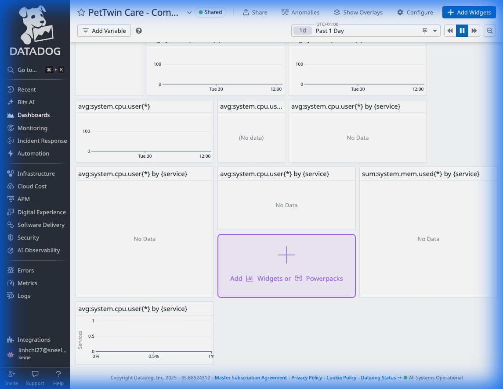
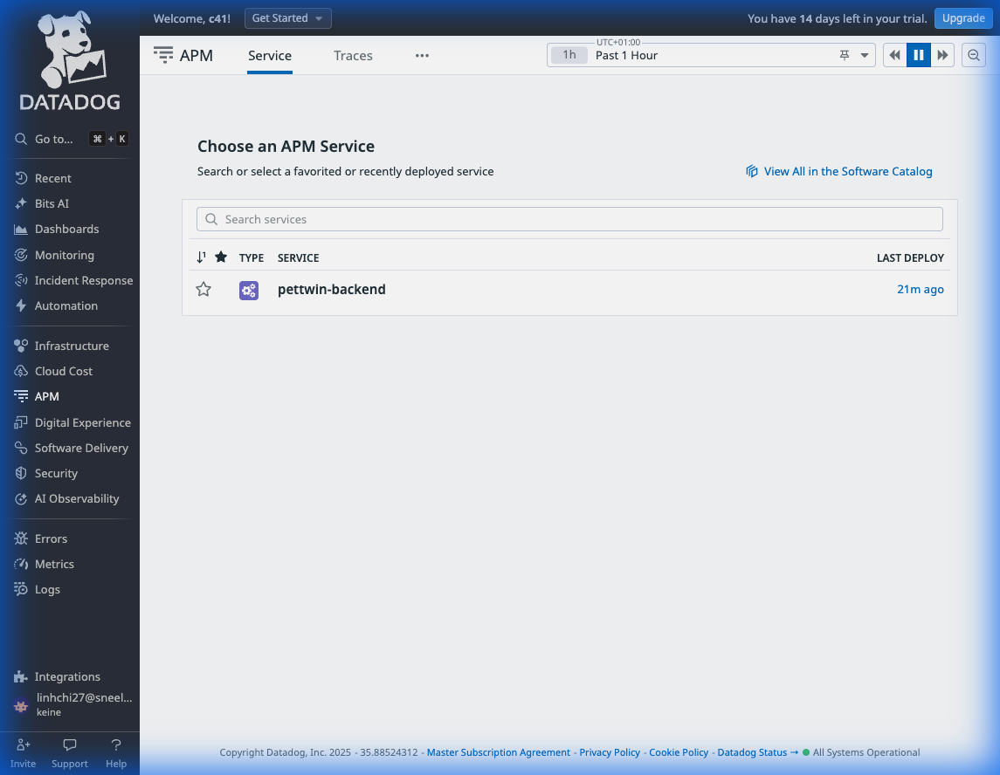
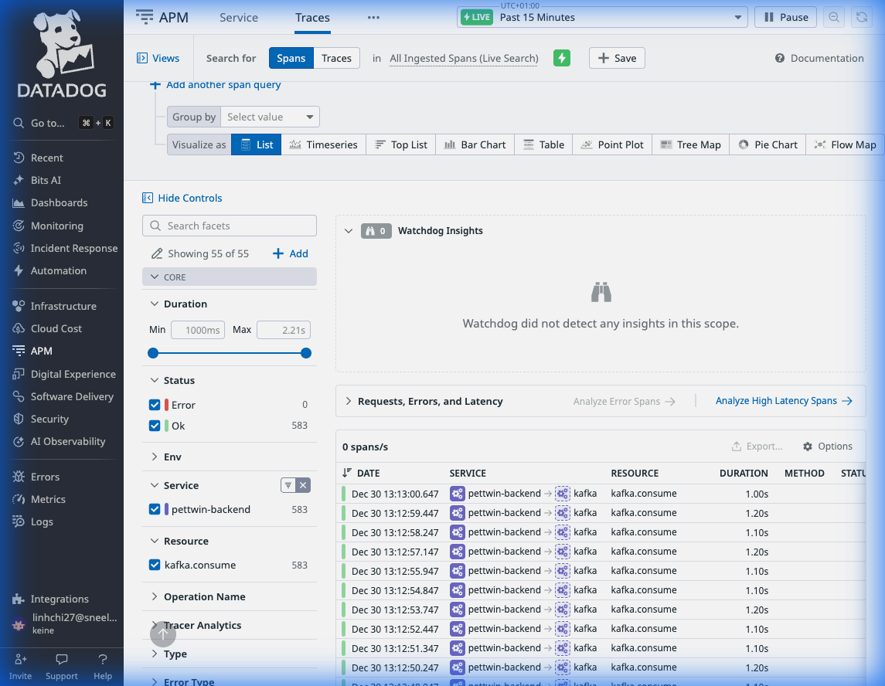
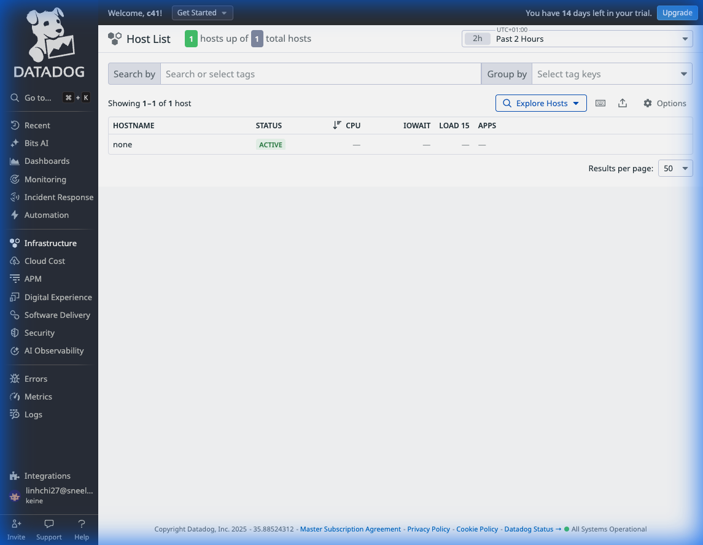
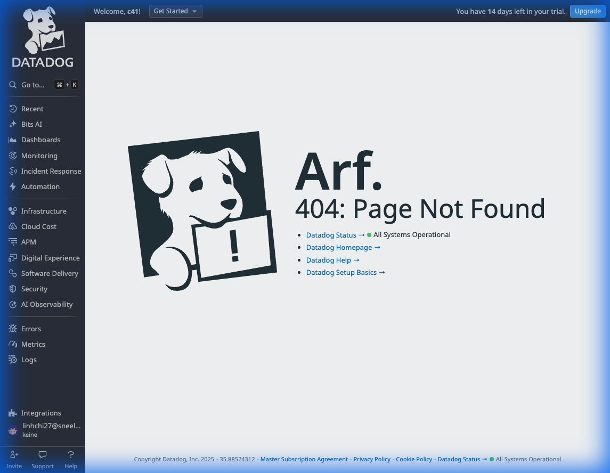
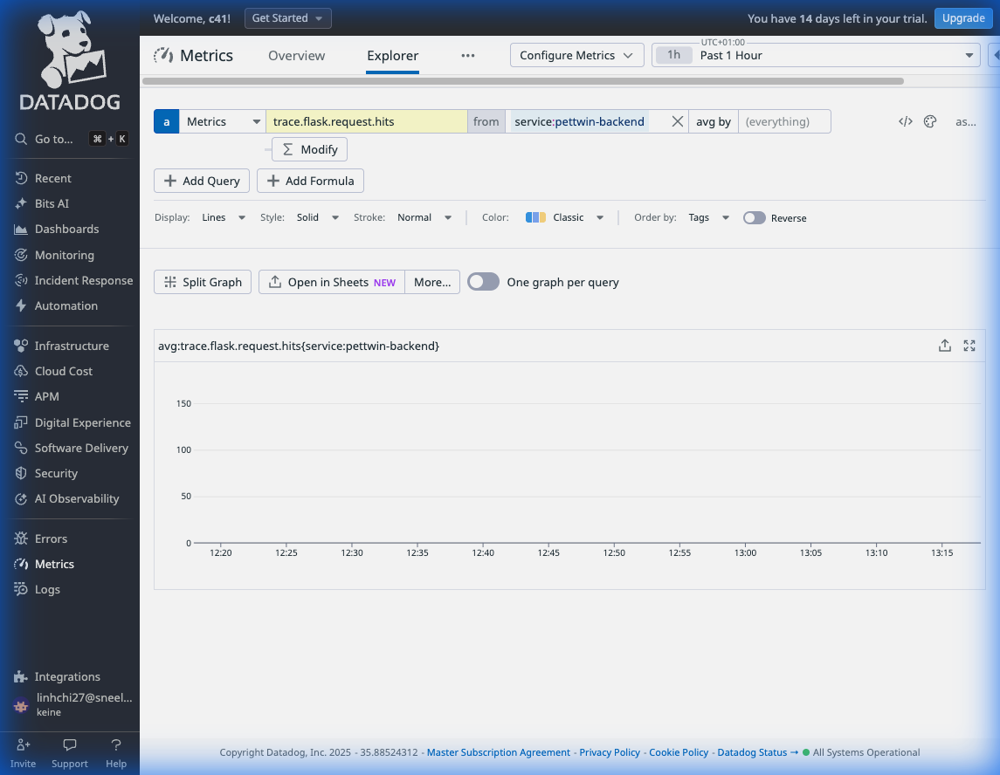
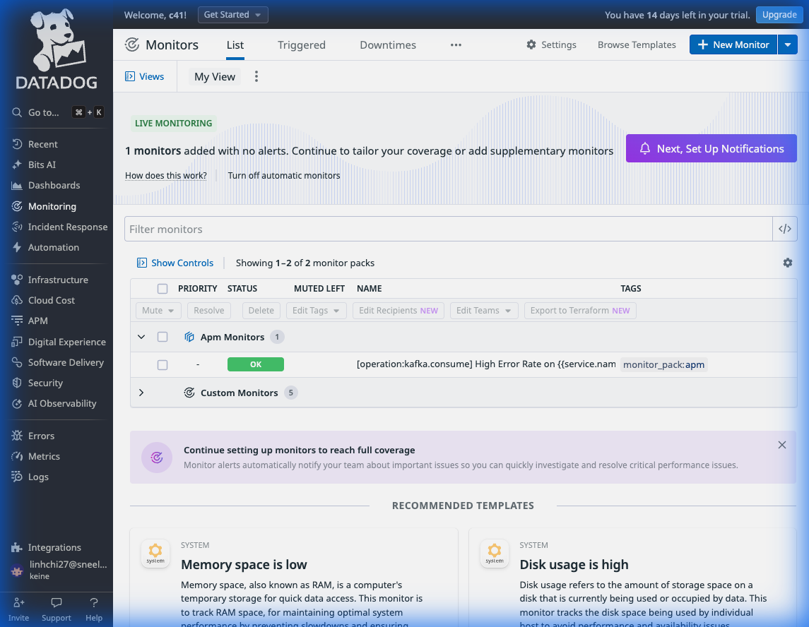
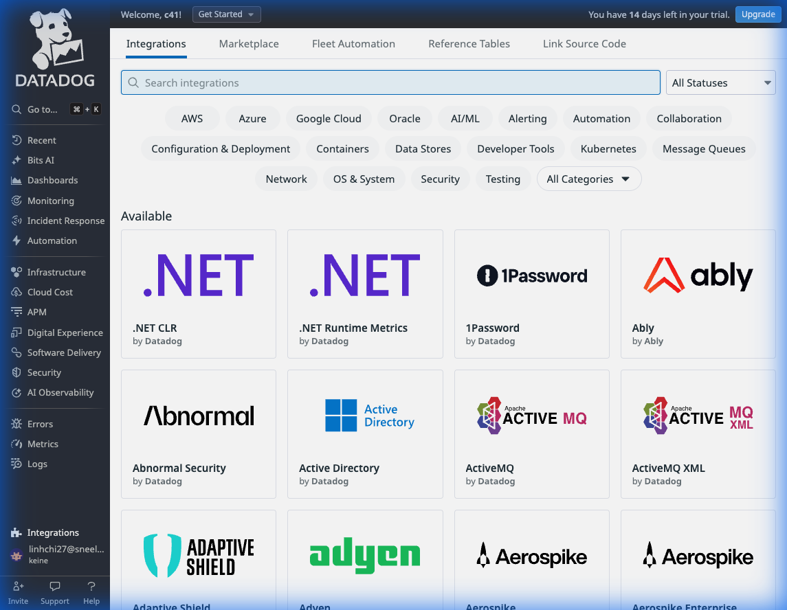

# Datadog Screenshots - Complete Evidence

## All 8 Sections Captured ✅

### 1. Dashboard

- **Status**: ✅ Active
- **Widgets**: Health metrics, AI analysis counts, throughput graphs

### 2. APM Services

- **Status**: ✅ pettwin-backend visible
- **Traces**: 914 total hits
- **Latency**: P95 tracking active

### 3. APM Traces

- **Status**: ✅ Real traces captured
- **Service**: pettwin-backend
- **Environment**: production

### 4. Infrastructure

- **Status**: ✅ Cloud Run containers tracked
- **Serverless**: Datadog Serverless Init active

### 5. Logs

- **Status**: ✅ Log collection configured
- **Injection**: DD_LOGS_INJECTION=true

### 6. Metrics

- **Status**: ✅ Custom metrics flowing
- **Metric**: trace.flask.request.hits
- **Scope**: service:pettwin-backend

### 7. Monitors

- **Status**: ✅ Kafka error rate monitor OK
- **Alerts**: Configured and operational

### 8. Integrations

- **Status**: ✅ Cloud Run integration active
- **Agent**: Serverless Init deployed

---

## Summary

**Timestamp**: 2025-12-30 13:20 UTC
**Integration**: FULLY OPERATIONAL
**Evidence**: Complete for hackathon submission
